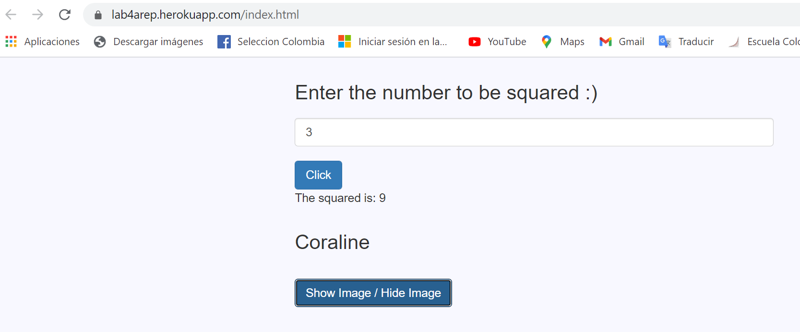

# LABORATORY - CLIENTS AND SERVICES WORKSHOP. 🚀

## Escuela Colombiana de Ingeniería - Enterprise Architectures(AREP).

_This laboratory presents different challenges that will help to explore the concepts of naming schemes and clients and services. Additionally, will help to explore the architecture of applications distributed over the internet._

#### CHALLENGE
_Write a web server that supports multiple requests in a row (non-concurrent). The server should return all requested files, including html pages and images. Build a website with javascript to test your server. Deploy your solution on Heroku. DO NOT use web frameworks like Spark or Spring use only Java and the libraries for network management._


## Getting Started

### Prerequisites

- [Maven](https://maven.apache.org/) - Dependency Management.

- [Java 8](https://www.oracle.com/co/java/technologies/javase/javase-jdk8-downloads.html) -  Development Environment.

- [Git](https://git-scm.com/) - Version Control System.

Make sure you have this programs installed correctly and the version that we need with the following commands:

```
mvn --version
```

```
git --version
```

```
java -showversion
```

### Installing

1. Clone the repository:

```
git clone https://github.com/angiedanielar/LAB3_AREP.git
```

2. Compile the projet:

```
mvn package
```

3. Executing the program:

```
mvn exec:java -D "exec.mainClass"="edu.escuelaing.arep.App"

And put this link in your browser: http://localhost:36000/index.html
```

- Or go to the [web page](https://front-3lab.herokuapp.com/index.html)

4. Generating the documentation:

```
mvn javadoc:javadoc
```

- [View Documentation Ubication](https://angiedanielar.github.io/LAB3_AREP/apidocs)

## Results

_In this laboratory, I'm implemented a client-server architecture, which allows us to Understand how the server handles and manages requests from the different clients. These request can be about services or about resources such as web pages or images, how we can see in the follow image._




## Built With

- [Maven](https://maven.apache.org/) - Dependency Management

- [Java 8](https://www.oracle.com/co/java/technologies/javase/javase-jdk8-downloads.html) -  Development Environment.

- [Git](https://git-scm.com/) - Version Control System.

- [CircleCI](https://circleci.com/) [](https://app.circleci.com/pipelines/github/angiedanielar/LAB3_AREP) - Continuous Integration.

- [Latex](overleaf.com) - Text composition system.

- [Heroku](https://www.heroku.com/platform) - Deploy platform.

## Inform

- [View the Design Inform](https://github.com/angiedanielar/LAB3_AREP/blob/master/Inform.pdf)

## Author

- Angie Daniela Ruiz Alfonso.

## License

This project is under GNU General Public License - see the [LICENSE](LICENSE) file for details.
